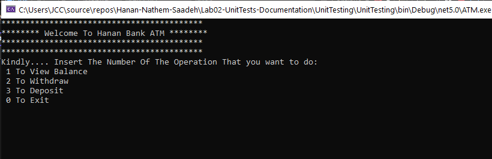
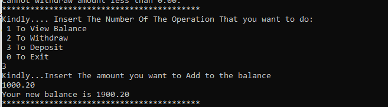
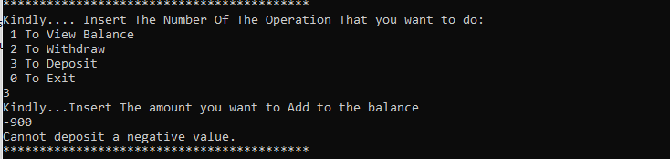
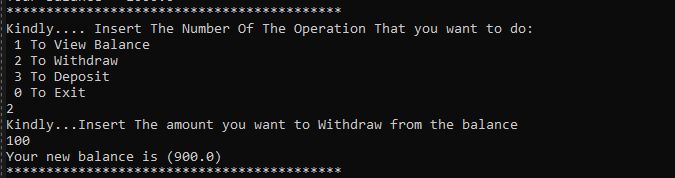
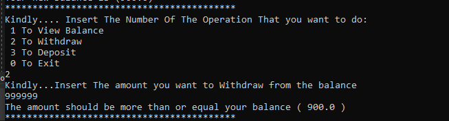
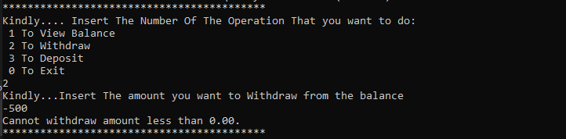
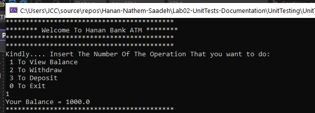
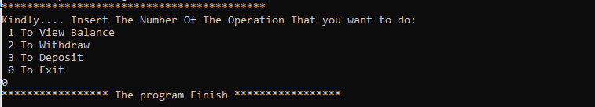
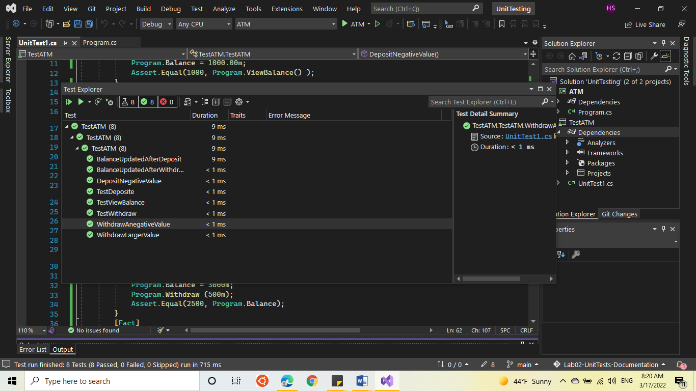

# Lab2-UnitTesting

###  Name 
Unit Testing (ATM System)

### One-Liner
This program is a C# Console application for ATM with 4 choices:
- deposit
- withdraw
- check balance
- exit

### Usage

1-  You will be given 4 numbered choices: check balance, withdraw,deposit and exit.
*  If you type in 1, you will get to see your balance.
*  If you type in 2, you get to withdraw. it is not allowed to insert negative number, AND a number more than your balance .
*  If you type in 3, you get to deposit. .and it is not allowed to insert negative number.
*  If you type in 4, you will then be exited of the program.

### Visual

* ATMSystem

* DepositPos

* DepositNeg

* WithDrawPosValue

* WithdraeLarger

* WithDrawNegValue

* ViewBalance

* exit

### The UnitTest For my ATM System

### Installation
Install Visual Studio 2022 and .NET Core 5.00.

### License
This program's License is MIT.

